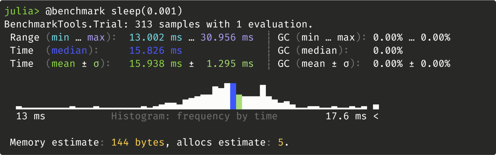
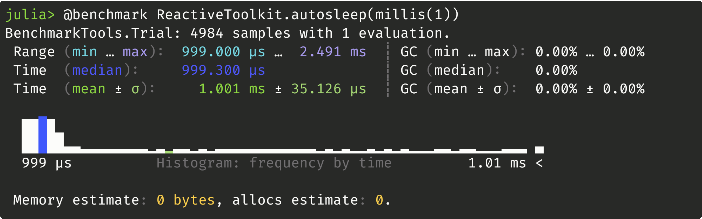

# Examples and Design Patterns
These are fairly minimal toy examples. Many of them may not be a good idea, or lead to something that is a bad idea. For now, please treat them as food for thought.

## Topics vs Captured Variables

As a closure:
```julia
@after seconds(3) begin
    i = 0
    task = @every millis(5) println("hello! i=$(i+=1)")
    @after seconds(3) kill(task)
end
# i is not defined
```

As a topic:
```julia
@topic j = 0
@after seconds(3) begin
    task = @every millis(5) println("hello! j[]=$(j[]+=1)")
    @after seconds(3) kill(task)
end
# j[] is 600
```

## Timing
Windows 11 22H2:

ReactiveToolkit.jl:


## Topic/Task Generators
Sometimes we want lots of tasks that are almost identical, but with different parameters. Why not use a loop to build them? (see tests_compound.jl)


## Custom Message Types
Since topics can hold any julia type, messages can be defined by whatever type we want. This includes custom structs:
```julia
struct RobotStatus
    battery_level::Float64
    is_ok::Bool
end
@topic status = RobotStatus(100, true)
```

existing data structures and container types:
```julia
@topic status = (100, true)
@topic status = Dict("battery_level"=>100, "is_ok"=>true)
@topic status = (battery_level=100, is_ok=true)
@topic status = "BATT:100,ISOK:1"
```

or *literally* anything:
```julia
@topic status::Any = (100, true)
status[] = Dict("battery_level"=>100, "is_ok"=>true)
status[] = "I hope this doesn't break anything"
```
You may see why this isn't necessarily a good idea. But it's possible!

## Automatic Plotting
If we lean into the abstraction, we can do things like this:
```julia
using ReactiveToolkit
using CairoMakie

@topic idx = 1
@topic fig = Figure()
@topic data = Vector{Float64}[]

@on fig "autosave" begin
    save("./plots/figure_$(idx[]).png", fig[])
    idx[] += 1
end

@on data "autoplot" begin
    fig[] = lines(data[])
end

# now we can automatically plot and save data simply by storing it:
data[] = rand(10)
```